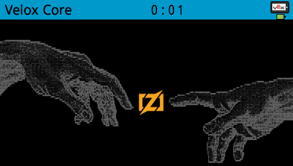

<p align="center"></p>

<br>

<h1 align="center">Velox</h1>

<p align="center"><strong>A Zig platform for VEX V5.</strong></p>

> [!WARNING]
> Velox has not hit alpha yet. It can boot on the brain, allocate memory, render graphics, and call VEX SDK bindings, but competition and device APIs are being developed.

## Roadmap

- [x] Write boot code
- [x] Custom Allocator Override
- [x] Panic handler with stack traces
- [x] Jumptable integration
- [ ] Device Drivers
- [ ] Odometry, Control, & Localization Library
- [ ] Custom Uploader program
- [ ] GUI library (Potentially written on top of a library like [Knots](https://codeberg.org/shahwali/knots))

#### Additional work

- [ ] Refactor `velox-jumptable` to just read from C header files and map memory addresses instead of generating bindings
- [ ] Refactor `velox-jumptable` into this monorepo

## Modules

- [Kernel](./src/kernel/README.md)
- [SDK](./src/sdk/README.md)
- [Umm](./src/umm/README.md)

## Competition Legality

According to rule `<R8>` of the Override Game Manual, custom firmware modifications are not permitted. Velox is a user program. Like PROS and Vexide, it should be 100% fair game, so long as you understand what it does.

## Acknowledgements

This project would not have been possible without the research from these projects and teams:

- [PROS](https://pros.cs.purdue.edu/)
- [Vexide](https://vexide.dev/)
- [38535B High Stakes Source](https://github.com/tubaplayerdis/Gold4Team3CompProj)
- [vex-v5-research](https://github.com/hatf0/vex-v5-research/tree/master)
- [VEXAPI](https://github.com/cetio/VEXAPI)

Velox builds on their research into the Brain's memory model and configuration.

## Tests

Tests are written in Zig's testing framework, and their results are logged over serial. Currently, only tests from the kernel are being recognized. Tests from other modules are not being recognized.

Tests run inside of a custom test runner which is itself written using Velox as a program. To run them yourself:

```sh
zig build run
```

I am currently exploring the avenue of using this test runner with other modules, so that way user code could have tests run and we can run actual hardware tests for projects like velox-umm.
